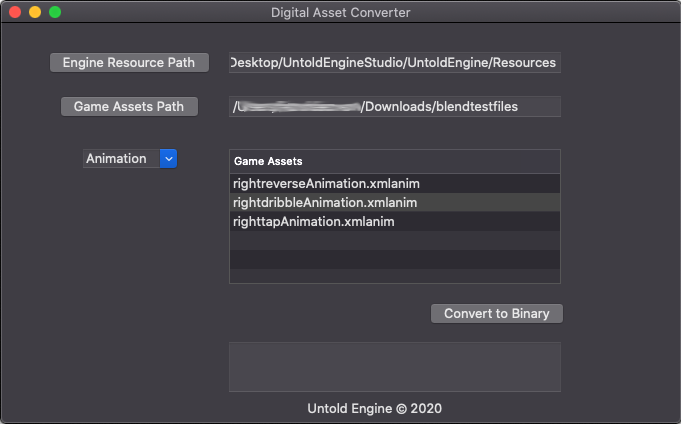

# Digital Asset Converter

The Digital Asset Converter is a plugin for the Untold Engine. It convert xml 'scene' data, animation and png data extracted from Blender3D into binary data. Currently, it converts the following data file types into binary data the Untold Engine understands:

- xml data- It includes mesh and animation data.
- png data- This is the image data use as textures

## How to use the tool

To use the tool, you must first browse to two folders:

*Engine Resource Path*: This is the path to the Resources folder of the Untold Engine. All the converted files will be stored here.

*Game Assets Path*: This is the folder that contains your unconverted (.xmlscene, .xmlanim, .png) game assets.

To convert an asset to binary, choose the the appropriate selection from the drop down menu and click on the file that you want to convert.

### Note

There is a particular issue that may prevent the app from opening your files. To fix this click on the Project's Target->Signing & Capabilities->App Sandbox and make sure the File Access Type's permissions are set to Read/Write. The User Selected and Download folders should have read/write access.

For more information on how to use this plugin, visit [Untold Engine](http://www.untoldengine.com).
